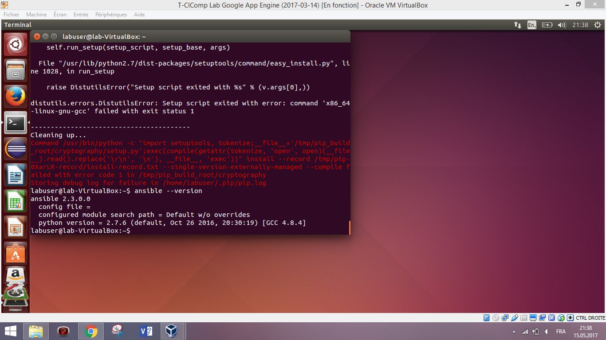
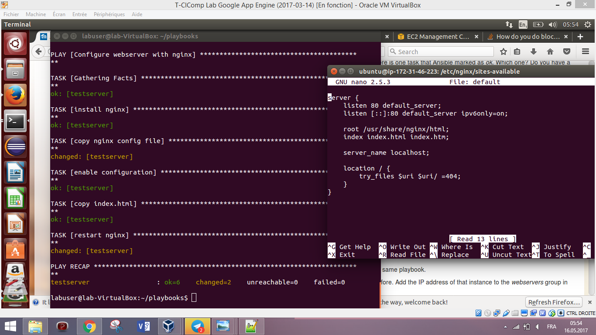

# LABORATOIRE 7 - Configuration management

Dans ce laboratoire nous nous intéressons au gestionnaire de configuration. En effet, nous allons nous familiariser avec les outils de gestion de configuration comme ansible, déployer une application web dans un mode automatisé et enfin se familiariser avec un état de configuration voulu. 

## ETUDIANTS 

* FRANCHINI Fabien
* DONGMO NGOUMNAI Annie Sandra

## TABLE DES MATIERES 
1. [Tâche 1: Installation d'ansible](#t%C3%82che-1-installation-ansible)
2. [Tâche 2: Création d'une machine virtuelle dans amazon web service](#t%C3%82che-2-creation-machine-virtuelle-dans-amazon-web-service)
3. [Tâche 3: Configuration d'ansible pour la connection au gestionnaire de la VM](#t%C3%82che-3-configuration-ansible-pour-connection-a-la-vm)
4. [Tâche 4: Installation de l'application web](#t%C3%82che-4-installation-application-web)
5. [Tâche 5: Test de l'état voulue de la configuration principale](#t%C3%82che-5-test-etat-voulue-de-la-configuration-principale)
6. [Tâche 6: Ajout d'un gestionnaire pour redemarrage de NGINX](#t%C3%82che-6-ajout-d-un-gestionnaire-pour-redemarrage-de-nginx)
7. [Tâche 7: Ajouter plus de gestionnaire de serveur](#t%C3%82che-7-ajouter-une-instance-au-gestionnaire-d-instance)


## TÂCHE 1: INSTALLATION ANSIBLE
Nous avons choisi de travailler avec la machine linux version 14.04 LTS, ainsi nous avons installer python (necessaire pour installer ansible) et ansible comme vous pouvez le constater sur l'image suivante 


## TÂCHE 2: CREATION MACHINE VIRTUELLE DANS AMAZON WEB SERVICE

Nous avons déjà vu lors du laboratoire sur Amazon web service comment faire pour créer une instance EC2 et s'y connecté en ssh ou http.

-creation de la clé paire public/privé si elle existe pas déjà : dans notre cas nous avions déjà une clé dans la région de Virginie du nord voire screenshort


-creation du sécurity groupe autorisant les connections SSH, HTTP et HTTPS entrant


-creation de l'instance ec2(t2.medium, Ubuntu 16.04) et attribution de la clé, du security groupe à l'instance 


-après création de lancement et verification de la connection ssh


## TÂCHE 3: CONFIGURATION ANSIBLE POUR CONNECTION A LA VM
Pour connecter ansible à la VM nous avons:
-crée un repertoire playbooks contenant un fichier de configuration hosts dans lequel nous allons spécifier les information utiles à la connection en ssh de l'instance (la clé privée, adresse public et type de la machine). Dans notre cas en plus de ces informations nous avons dû spécifier la version de python(version 3) qu'ansible devrais utilisé (ne marchait pas avec la version 2.7 ).Verification du bon fonctionnement de la config avec un ping


Pour faciliter la configuration d'ansible nous allons utiliser un vrai fichier de config ansible.cfg qui nous permettre de modifier certaine valeures par défaut. Après ce changement on n'aura plus besoin de spécifier l'inventaire dans la commande on obtient donc les resultats suivant après les manipulations:


## TÂCHE 4: INSTALLATION APPLICATION WEB 
ici, pour installer l'application web nous avons suivit les étapes données pour la creation, construction du playbooks et obtenu le resultat suivant lors de son premier lancement:


Et le test du bon focntionnement de l'installation à partir d'un browser nous a donné le résultat suivant: 


## TÂCHE 5: TEST ETAT VOULUE DE LA CONFIGURATION PRINCIPALE

-lors du 2ème lancement d'ansible on remarque qu'on a plus qu'une seule tâche en changed(retsart nginx ) contrairement au premier lancement ou on avait 4 changed ce qui est normal car pour l'installation de nginx on a specifier qu'il pouvais être mis en cache avec `update_cache=yes` qui permet lors d'une seconde exécution d'aller cherger en mémoire s'il y a ou pas le programme déjà installé pour ce qui est des autres tâche il s'agit des copies sur des copies existantes donc il n'y aura rien à modifier

 après avoir mis en commentaire `update_cache=yes` sur la tache install nginx on obtenu le même resultat.
 
 -si l'on modifie le fichier default dans la VM comme suivant:
 
 
 on remarque que lors du prochain run se fichier sera écrasé par celui fourni par ansible ainsi la tache `copy nginx config file` se met à l'etat changed comme suit:
 
 
 -après suppression de la page d'acceuil on a la tache ` copy index.html qui revient à l'etat changed ` puis lors des autres exécution revient à l'etat OK.
 On peut déduire de cela que l'etat ok est retourné quand la tâche avait déjà été effectuée avec le mêmme contenu(de destination bien-sûr) et l'etat Changed lorsque la tâche s'exécute pour la première ou le contenu de destination a été modifier d'une certaine manière (il génère un nouveau contenu dans la VM) 
 

## TÂCHE 6: AJOUT D UN GESTIONNAIRE POUR REDEMARRAGE DE NGINX

après l'ajout du gestionnaire (En principe nous avons juste changer la tache `restart nginx` en Handle et ajouter des notify sur les autre tâche pour qu'il ne s'exécute que si les autre tâches ont changées d'état) suivant le code : 
```
- name: Configure webserver with nginx
  hosts: webservers
  sudo: True
  tasks:
    - name: install nginx
      apt: name=nginx update_cache=yes
      notify:
         - restart nginx
    - name: copy nginx config file
      copy: src=files/nginx.conf dest=/etc/nginx/sites-available/default
      notify:
         - restart nginx
    - name: enable configuration
      file: >
        dest=/etc/nginx/sites-enabled/default
        src=/etc/nginx/sites-available/default
        state=link
      notify:
         - restart nginx
    - name: copy index.html
      template: src=templates/index.html.j2 dest=/usr/share/nginx/html/index.html mode=0644
      notify:
         - restart nginx
  handlers:
    - name: restart nginx
      service: name=nginx state=restarted
```
on obtient lors du lacement du programme un resultat tout en vert : 


## TÂCHE 7: AJOUTER UNE INSTANCE AU GESTIONNAIRE D INSTANCE

En ajoutant une instance supplémentaire au webserver on ne constate aucun changement dans la sotie de l'execution du .yml en plus en verifiant l'accessibilité de l'instance à partir de notre browser on remarque que son contenu est identique à celui de la 1ère instance
-modification web.yml pour ajouter l'adresse IP de la nouvelle instance:


-vérification accès par browser de l'instance après exécution du yml


si rend indisponible une des 2 instance aucune erreur n'est retourné lors de la reexécution du yml:


